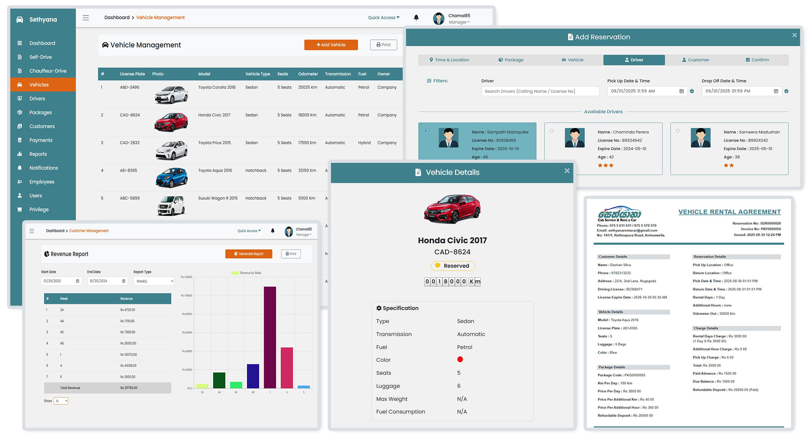

---

[](https://github.com/RandulaTharaka/Sethyana-Car-Rental)
[](https://github.com/RandulaTharaka/Sethyana-Car-Rental)


# Sethyana Car Rental Management System 
> A Full-Stack Java Spring Boot Web Application

🌐 Visit Site: [www.sethyana.rental](https://sethyana-car-rental-1047985755351.us-central1.run.app)




## 🚀 Project Overview

This is a Java Spring Boot web application that digitizes car rental operations for Sethyana Rent a Car & Cab Service. Includes secure auth, role‑based access, reservations, payments, reporting, and a mobile‑friendly driver portal.

[//]: # (### ✅ Quick Glance)

[//]: # ()
[//]: # (| Area       | Highlights                                                                                                                            |)

[//]: # (| ---------- |---------------------------------------------------------------------------------------------------------------------------------------|)

[//]: # (| Frontend   | HTML, CSS, Bootstrap, JavaScript, jQuery with responsive UI                                                                           |)

[//]: # (| Backend    | Java 11 / Spring Boot REST controllers, Spring Web Security, Hibernate/JPA, Gradle build, MySQL integration                           |)

[//]: # (| Data Layer | Hibernate/JPA entities and repositories for relational data &#40;Users, Vehicles, Reservations, Drivers, Payments&#41; with MySQL integration |)

## 🎯 Why I Built This

As my final year project for the Bachelor in IT at the University of Colombo, I chose to tackle a complex, real-world problem to deepen my software engineering skills. My goal was to design and implement a robust solution that delivers genuine value and addresses actual business needs.

## 🛠️ Tech Stack

| Layer      | Tools & Technologies                                                                                                                |
| ---------- |-------------------------------------------------------------------------------------------------------------------------------------|
| Frontend   | HTML, CSS, Bootstrap (SASS customized), JavaScript, jQuery, Adobe XD (wireframes & mockups)                                         |                                                                        |
| Backend    | Java, Spring Boot, Spring Security, Hibernate (JPA), REST controllers, Gradle, JavaMailSender (Email service), Twilio (SMS service) |
| Auth       | Spring Security (role-based access), BCrypt password encryption                                                                     |
| Database   | MySQL, Google Cloud SQL Instance                                                                                                    |
| Deployment | Docker, Google Cloud Run, Heroku (containerized deployment, CI/CD ready)                                                            |
| Tooling    | IntelliJ IDEA, MySQL Workbench, Google Cloud Run                                                                                    |
| Other      | Server/client-side validation (regex, annotations)                                                                                  |

## ✨ Core Features

- Secure user authentication & role-based access (manager, receptionist, driver)
- Self-drive & Chauffeur-drive reservation management
- Checkout flow: Time&Location → Package → Vehicle → Driver → Customer → Confirm → Payment
- Vehicle listing, detail view & availability search
- Rental package management 
- Customer management & blacklist checks
- Driver job assignments & ratings
- Payment processing & printable receipts & agreements
- Email and SMS notifications for booking confirmations 
- Driver portal for mobile-friendly job management
- Admin dashboard for fleet, users, and revenue reporting
- Search & filtering with pagination
- Daily & monthly revenue reports
- Notifications for expirations (driving license, insurance, revenue license) 
- Server & client-side form validation (regex, annotations)
- Error handling with custom error pages
- Responsive UI with Bootstrap

## 🧠 Developer Notes

📄 [Final Year Dissertation (University of Colombo)](docs/Sethyana_Car_Rental_Dissertation.pdf)

> This dissertation covers the complete research, analysis, design, implementation, and evaluation of the Sethyana Car Rental Management System. 
> It includes system requirements, architecture, UML diagrams, testing strategies, and user manuals, as submitted for the Bachelor in IT final year project at the University of Colombo.

## 🎬 Feature Demos

### 🛒 Cart & Checkout


### 🛠 Admin Panel


## 📚 Selected API Endpoints

| Method | Endpoint                                                                                  | Description                                                  |
|--------|-------------------------------------------------------------------------------------------|--------------------------------------------------------------|
| POST   | /api/user                                                                                 | Register a new user                                          |
| GET    | /api/vehicle/list                                                                         | Retrieve vehicle list                                        |
| POST   | /api/cd_reservation/                                                                      | Create chauffeur-drive reservation                           |
| GET    | /api/package/cdr_list                                                                     | Retrieve chauffeur-drive packages                            |
| GET    | /api/customer_payment/next_pay_invoice_no                                                 | Generate next payment invoice number                         |
| GET    | /api/customer_payment/advance_payment?reservation_id={id}                                 | Make advance payment for a reservation                       |
| GET    | /api/sd_reservation/on_going_list_by_vehicle?vehicle_id={id}                              | List ongoing self-drive reservations for a vehicle           |
| GET    | /api/sd_reservation/findAll?page={page}&size={size}&searchtext={text}                     | Retrieve paginated self-drive reservations (with search)     |
| GET    | /api/report/revenue_report?sdate={sdate}&edate={edate}&type={type}                        | Generate revenue report for a date range                     |
| GET    | /driver/list_by_pickdate_returndate?cdr_expt_pick_date={date}&cdr_expt_return_date={date} | List available drivers for specified pickup and return dates |


## 🧩 Architecture Overview
```
 docs/
   screenshots/   # App screenshots
   wireframes/    # Initial wireframes & mockups
   diagrams/      # Architecture & ER diagrams
   Sethyana_Car_Rental_Developer_Notes.pdf
   database.sql # SQL script to create & populate the database
 src/
    main/
      java/
        com/
          sethyanacarrental/
            config/         # Spring web security configuration
            controller/     # REST controllers
            model/          # JPA entities (User, Vehicle, etc.)
            repository/     # Data access layer
            service/        # Email & SMS services
            util/           # Helpers & validation
      resources/
        static/             # Frontend assets (HTML, CSS, JS, images)
        application.properties   # Spring Boot app settings (DB, server port, credentials)
    test/
      java/
        com/
          sethyanacarrental/  # Unit & integration tests
  build.gradle                # Build config
  Dockerfile                  # Containerization
  system.properties           # JVM settings
```

## 📦 Installation

### Prerequisites

- **Java 11**
- **MySQL 8.0**
- **MySQL Workbench**
- **IntelliJ IDEA**
- **Web browser**
- **Docker**  
- **Google Cloud SDK**
- **Twilio Account**

1. **Clone the repository**
   ```bash
   git clone https://github.com/RandulaTharaka/Car-Rental-Management-System.git

2. **Create a MySQL Connection**
   - Open MySQL Workbench.
   - Click the + icon next to MySQL Connections.
   - Set Connection Name (e.g., Sethyana Car Rental).
   - Set Hostname to localhost.
   - Set Port to 3306.
   - Set a Username.
   - Click Store in Vault... and enter a password.
   - Click Test Connection to verify.
   - Click OK to save the connection.


3. **Create the database**
   - Open MySQL Workbench and connect to your MySQL server.
   - Go to File → Open SQL Script.
   - Select your `database.sql` file in the `docs` folder in root.
   - The SQL script will open in a new tab.
   - Click the Execute (lightning bolt) button to run the script and import the database.


4. **Import the project**
   - Open the `sethyana_car_rental` folder in IntelliJ IDEA.
   - Allow Gradle to download dependencies.


5. **Set up environment variables:**  

   Rename the `.env.example` file to `.env` and add the following

   ```env
   # Database configuration
   DB_URL=jdbc:mysql://<HOST>:<PORT>/<DATABASE_NAME>?useSSL=true
   DB_USERNAME=your_mysql_username
   DB_PASSWORD=your_mysql_password
   
   # Twilio configuration
   ACCOUNT_SID=your_twilio_account_sid
   AUTH_TOKEN=your_twilio_auth_token
   FROM_NUMBER=your_twilio_phone_number
   ```
   Now load these environment variables in IntelliJ IDEA:
   - Go to `Run -> Edit Configurations`.
   - Select `SethyanaCarRentalApp` from the list on the left.
   - Select `Modify Options` and then select `Environmental variables` from the list.
   - Click on the `Folder icon` in the `Environment variables` field.
   - Browse and select the `.env` file.
   - Click OK to save.


6. **Run the application**
   - In IntelliJ IDEA, select `Run SethyanaCarRentalApp` from the menu.


7. **Access the app**
   - Open your browser and go to `localhost:8080/login`.
   - Log in using the provided demo credentials.

       |     Role             |     User Name     |     Password      |
       |----------------------|-------------------|-------------------|
       |     Manager          |     Chamal85      |     Chamal85      |
       |     Receptionist     |     Nipuni92      |     Nipuni92      |
       |     Receptionist     |     Hasitha91     |     Hasitha91     |
       |     Driver           |     Sampath79     |     Sampath79     |
       |     Driver           |     Chaminda82    |     Chaminda82    |
       |     Driver           |     Sameera86     |     Sameera86     |


## 🚢 Deployment

- **Containerization:** Backend packaged with Docker for consistent deployment.
- **Cloud Hosting:** Deployed on Google Cloud Run for scalable, serverless operation.
- **CI/CD:** Automated build and deployment pipelines for rapid updates.
- **Configuration:** Environment variables and secrets managed securely via cloud platform settings.
- **Database:** MySQL hosted on Google Cloud SQL.
- **Frontend:** Static assets served from the Spring Boot application.

## 🚧 Future Enhancements (Roadmap)

| Category     | Planned Improvements                                         |
|--------------|--------------------------------------------------------------|
| Tracking     | Integrate vehicle tracking with GPS technology               |
| Maps         | Google Maps API for pickup/drop-off selection                |
| Reservations | Enable online reservation for customers                      |
| Payments     | Add online payment facility                                  |
| Reporting    | Expand reporting features (fleet, revenue, usage analytics)  |
| Mobile       | Enhance responsiveness or develop Android mobile app         |


## 📄 License

This project is open source and available under the [Sethyana Car Rental Software License](LICENSE).

## 🤝 Connect With Me

I'm passionate about building full-stack applications and open to new opportunities in software development.

Feel free to connect or reach out!

[](https://www.linkedin.com/in/randula-tharaka-79a61a145/)
[](mailto:iamrandula@gmail.com)
